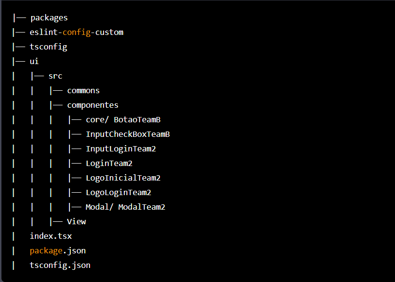

<h1 align="center"> Página de Login - GSAN</h1>

Desenvolvimento do layout, da página inicial do sistema GSAN – CAGEPA, utilizando as tecnologias React, Typescript e Next.js. 

O layout tem com o objetivo, ser integrado ao sistema atual do GSAN, visando a substituição da página de login atual, para um novo layout moderno, responsivo e objetivo.

# Funcionalidades

- `Funcionalidade 1`: Recebimento de e-mail e senha do usuário
- `Funcionalidade 2`: Validação previa das entradas das informações
- `Funcionalidade 3`: Responsividade da página para dispositivos móveis
- `Funcionalidade 4`: Recebimento dos dados de entrada para armazenamento e validação

# Tecnologias

`HTML5`
`CSS`
`JAVASCRIPT`
`REACT`
`TYPESCRIPT`
`NEXT`

# Instalações | Comando Úteis

`IDE`: VSCode

`Node.js`: npm install

`ToastFy`: npm install - -save toastfy -js

# Estrutura de pastas do Projeto Login GSAN-CAGEPA

								

---------------------------------------------------------------------------
---------------------------------------------------------------------------

<ul>
    <li>packages: packages: pasta principal do projeto</li>
    <li>eslint-config-custom: configurações personalizadas do ESLint</li>
    <li>tsconfig: arquivo de configuração do TypeScript</li>
    <li>ui: pasta que contém tudo relacionado à interface do usuário, incluindo</li>
    <li>src: pasta que contém o código-fonte do projeto</li>
    <li>commons: arquivos comuns a todo o projeto</li>
    <li>componentes:  organização de componentes do React, incluindo</li>
    <li>core/BotaoTeamB</li>
    <li>InputCheckBoxTeamB</li>
    <li>InputLoginTeam2</li>
    <li>LoginTeam2</li>
    <li>LogoInicialTeam2</li>
    <li>LogoLoginTeam2</li>
    <li>Modal/ModalTeam2</li>
    <li>View: pasta que contém as visualizações do projeto</li>
    <li>index.tsx: arquivo principal do projeto</li>
    <li>package.json: arquivo que descreve as dependências e scripts do projeto</li>
    <li>tsconfig.json: arquivo de configuração do TypeScript.</li>
</ul>
